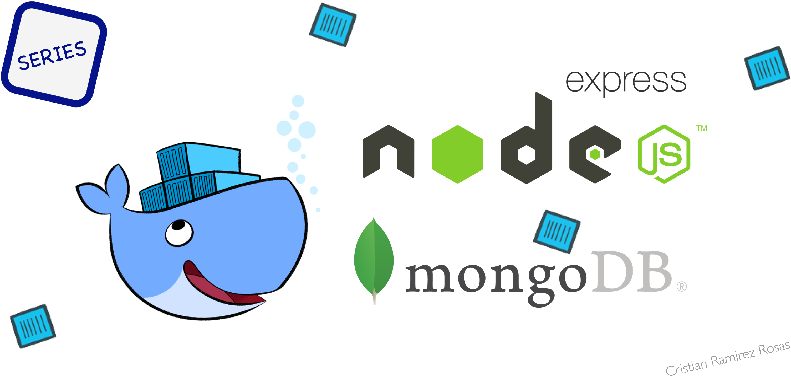

# Build a NodeJS microservice and deploy it to Docker

This is the repo example for the article.

### Stack
We’ll use a simple NodeJS service with a MongoDB for our backend.
- NodeJS V7
- MongoDB 3.4.1
- Docker for Mac 1.12.6

### Services

- [Movies Services example](./movies-service)
- [Cinema Catalog Services example](./cinema-catalog-service)
